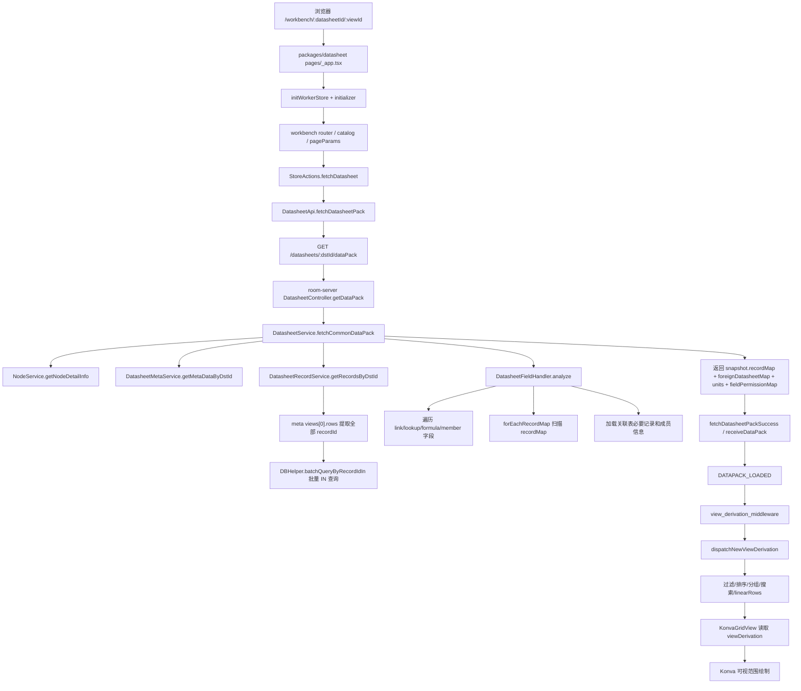

# 大表打开性能优化计划

本文记录本地自部署 fork 中，针对“表格记录量较大时打开慢”的框架盘点、性能风险点和后续改造计划。

当前结论：不要先替换网格渲染层。现有表格已经使用 Konva 并按可视行列范围绘制，首屏慢更可能来自数据包全量加载、关联字段扩展、主线程视图派生计算和大 JSON 传输/解析。优化应先做可观测性和数据链路减载，再考虑局部加载和服务端视图索引。

## 框架结构盘点

### Monorepo 和运行方式

根目录是 Nx + pnpm workspace：

```text
package.json
pnpm-workspace.yaml
nx.json
```

workspace 只包含：

```text
packages/*
```

主要包：

| 路径 | 作用 | 大表打开相关性 |
| --- | --- | --- |
| `packages/datasheet` | Next.js + React 前端，工作台、表格、仪表盘、小程序等 UI | 入口路由、请求 dataPack、Redux store、Konva 网格渲染 |
| `packages/core` | 共享数据模型、API action、Redux reducer/selectors、命令和视图派生计算 | `recordMap` 状态结构、过滤/排序/分组/搜索计算、JOT/OT 命令 |
| `packages/room-server` | NestJS Node 服务，dataPack、记录读取、关联字段分析、协同/房间服务 | 首次打开表格的数据包构造主路径 |
| `backend-server` | Java Gradle 后端，用户、空间、组织、节点、权限、管理等接口 | 登录、目录树、节点/字段权限、用户/组织信息 |
| `packages/databus-client` | databus OpenAPI client | databus API 调用封装 |
| `packages/databus-wasm*` | databus wasm Web/Node 包 | 潜在的 wasm dataPack/JSON0 能力，但当前浏览器 dataPack 调用未真正启用 |
| `packages/widget-sdk` | 小程序 SDK | 仪表盘小程序和数据订阅会间接触发表格数据读取 |
| `packages/components`/`icons`/`i18n-lang`/`l10n` | 通用组件、图标、多语言 | 非主瓶颈，但影响前端包体和渲染 |
| `gateway`/`docker-compose*.yaml` | 自部署网关和容器编排 | 生产自部署请求路由、压缩、服务拓扑 |

开发态 `packages/datasheet/server.js` 会代理：

| 路径 | 默认目标 | 说明 |
| --- | --- | --- |
| `/api` | `http://127.0.0.1:8081` | Java backend-server |
| `/nest` | `http://127.0.0.1:3333` | room-server HTTP |
| `/fusion` | `http://127.0.0.1:3333` | room-server/fusion 接口 |
| `/databus` | `http://127.0.0.1:8082` | databus |
| `/room`/`/document`/`/notification` | socket/document 服务 | 协同和通知 |

Docker Compose 生产自部署拓扑包含：

```text
web-server
backend-server
room-server
databus-server
gateway
mysql
redis
rabbitmq
minio
imageproxy-server
init-db
init-appdata
```

后续性能验证需要同时覆盖本地源码直跑和 docker compose 自部署，避免只优化其中一种路径。

## 当前大表打开链路



### 关键代码节点

前端入口和请求：

```text
packages/datasheet/pages/_app.tsx
packages/datasheet/pages/workbench/[[...all]].tsx
packages/datasheet/src/pc/components/route_manager/*
packages/core/src/modules/database/api/datasheet_api.ts
packages/core/src/modules/database/api/url.data.ts
packages/core/src/modules/database/store/actions/resource/datasheet/datasheet.ts
```

room-server dataPack：

```text
packages/room-server/src/database/datasheet/controllers/datasheet.controller.ts
packages/room-server/src/database/datasheet/services/datasheet.service.ts
packages/room-server/src/database/datasheet/services/datasheet.record.service.ts
packages/room-server/src/database/datasheet/services/datasheet.field.handler.ts
packages/room-server/src/database/datasheet/repositories/datasheet.meta.repository.ts
packages/room-server/src/database/datasheet/repositories/datasheet.record.repository.ts
packages/room-server/src/shared/helpers/db.helper.ts
```

视图派生计算：

```text
packages/datasheet/src/pc/store/view_derivation_middleware.ts
packages/core/src/compute_manager/view_derivate/factory.ts
packages/core/src/compute_manager/view_derivate/view_derivate_base.ts
packages/core/src/compute_manager/view_derivate/view_derivate_grid.ts
packages/core/src/compute_manager/view_derivate/slice/view_filter_derivate.ts
packages/core/src/compute_manager/view_derivate/slice/view_group_derivate.ts
packages/core/src/modules/database/store/selectors/resource/datasheet/rows_calc.ts
```

网格渲染：

```text
packages/datasheet/src/pc/components/konva_grid/konva_grid_view.tsx
packages/datasheet/src/pc/components/konva_grid/konva_grid_stage.tsx
packages/datasheet/src/pc/components/konva_grid/hooks/use_grid.tsx
packages/datasheet/src/pc/components/konva_grid/hooks/use_grid_cells.tsx
packages/datasheet/src/pc/components/konva_grid/hooks/use_grid_dynamic_cells.tsx
```

已有局部记录加载能力：

```text
packages/datasheet/src/pc/utils/load_records.ts
packages/core/src/modules/database/api/datasheet_api.ts
  fetchRecords(dstId, recordIds)
packages/room-server/src/database/datasheet/controllers/datasheet.controller.ts
  POST /nest/v1/datasheets/:dstId/records
```

Worker 相关但当前默认未启用：

```text
packages/datasheet/src/pc/worker/index.ts
  const useWorker = false

packages/datasheet/src/pc/worker/store/with_compute.ts
packages/datasheet/src/pc/worker/store/store_worker.ts
packages/datasheet/src/pc/worker/store/compute.ts
```

## 当前瓶颈假设

### 1. 首次 dataPack 是全量 recordMap

`DatasheetController.getDataPack` 只把可选 `recordIds` 传给 `fetchDataPack`。不带 `recordIds` 时：

```text
DatasheetRecordService.getUnarchivedRecordsByDstId
  -> DatasheetMetaRepository.selectRecordIdsByDstId
  -> DBHelper.batchQueryByRecordIdIn
```

也就是从 meta 的 `views[0].rows[*].recordId` 取出全部记录 ID，再按批次读取完整记录。

这能避免单次 SQL 过大，但仍会产生：

- room-server 内存中完整 records 数组和 `recordMap`。
- HTTP 响应中的完整 `snapshot.recordMap`。
- 浏览器端大 JSON 下载和解析。
- Redux 中完整 `recordMap` 写入。

### 2. 字段分析会扫描主表并扩展关联表

`DatasheetFieldHandler.analyze` 会处理 link、lookup、formula、member、createdBy、lastModifiedBy 等字段。

其中 `forEachRecordMap` 会遍历 `recordMap`，收集关联表记录 ID；随后 `fetchRecordMap` 加载关联表必要记录。大表中如果 link/lookup 多，会把首次打开成本从“主表全量”扩大到“主表全量 + 关联记录 + 成员信息”。

### 3. 视图派生计算同步执行

`DATAPACK_LOADED` 后，`view_derivation_middleware` 调用 `dispatchNewViewDerivation`。核心计算包括：

- 过滤：`ViewFilterDerivate.getFilteredRows`
- 排序：`sortRowsBySortInfo`
- 分组：`ViewGroupDerivate.getGroupDerivation`
- 搜索：`getSearchRows`
- 多个索引结构：`rowsIndexMap`、`visibleRowsIndexMap`、`linearRowsIndexMap`

这些计算当前在主线程同步执行。即使 Konva 只绘制可视区，首屏可交互前仍可能被全量派生阻塞。

### 4. 网格绘制已有可视范围，但仍依赖全量派生结果

`konva_grid_stage.tsx` 会计算：

```text
rowStartIndex
rowStopIndex
columnStartIndex
columnStopIndex
```

`use_grid_cells.tsx` 只循环当前可视行列。因此“把网格换成虚拟列表”不是第一优先级。

但 `konva_grid_view.tsx` 仍会读取完整：

```text
linearRows
visibleRows
visibleColumns
recordMap
groupBreakpoint
```

所以真正需要拆的是“全量数据和全量派生”的前置依赖。

### 5. 现有 worker 代码不能直接视为已解决

项目里已有 `pc/worker`、Comlink 和 `with_compute`，但 `initWorkerStore` 中写死：

```text
const useWorker = false
```

而且 worker 计算路径目前更像是读 selector 缓存并回写 computed 数据，不等同于已经把 `ViewDerivateFactory.getViewDerivation` 的全量计算移入 worker。后续不能只把开关改成 `true`，需要重新梳理主线程/worker 的职责和状态同步。

## 优化原则

1. 先加测量，再改逻辑。没有基线不要判断瓶颈。
2. 先复用现有局部记录加载能力，再设计新的分页 dataPack。
3. 先减少可选数据和后台计算，再动核心数据结构。
4. 保持 `@apitable/core` 作为单一视图计算语义来源，避免前后端算法分叉。
5. 自部署 fork 可以接受更直接的配置开关，但不能破坏权限、公式、关联、协同和小程序数据契约。

## 分阶段计划

### 阶段 0：基线测量和耗时埋点

目标：明确慢在服务端查询、字段分析、网络传输、JSON 解析、Redux 写入、派生计算、还是首帧绘制。

服务端埋点：

```text
DatasheetService.fetchCommonDataPack
  - getNodeDetailInfo
  - getMetaDataByDstId
  - getRecordsByDstId / getRecordsByDstIdAndRecordIds
  - datasheetFieldHandler.analyze
  - response record count / foreign record count

DatasheetRecordService
  - selectRecordIdsByDstId
  - each DBHelper batch query
  - commentCount query
  - formatRecordMap

DatasheetFieldHandler
  - parseField
  - forEachRecordMap
  - initLinkDstSnapshot
  - fetchRecordMap
  - unit/user query
```

前端埋点：

```text
fetchDatasheetApi request start/end
DATAPACK_LOADED dispatch
receiveDataPack start/end
dispatchNewViewDerivation start/end
setViewDerivation dispatch
KonvaGridView first render
first usable grid interaction
```

浏览器观测：

- `PerformanceObserver` 记录 Long Task。
- DevTools Network 记录 dataPack 响应体大小、下载耗时、waiting/download 比例。
- Performance profile 记录 JSON parse、Redux reducer、view derivation、React render。

验收输出：

- 1k、10k、50k 记录表分别记录一次打开链路耗时。
- 至少覆盖普通表、含 link/lookup/formula/member 字段的表、开启字段权限的表。
- 文档记录每段耗时和响应大小，作为后续阶段对比基线。

### 阶段 1：低风险减载

目标：不改变核心数据结构，先减少明显非首屏必需的工作。

候选改动：

1. 首屏 dataPack 可配置不加载评论数量。
   - 现状 `includeCommentCount` 未显式传值时默认 `true`。
   - 可增加自部署配置，例如 `SELF_HOST_FAST_DATAPACK=true` 时首屏 `includeCommentCount=false`。
   - 评论面板或评论图标需要时再按记录加载。

2. 检查 `revisionHistory`、`recordMeta`、`createdAt`、`updatedAt` 的首屏必要性。
   - `CreatedTime`、`LastModifiedTime` 字段可能依赖时间字段，不能盲删。
   - `recordMeta.fieldExtraMap`、附件、行高、历史记录可能依赖 `recordMeta`，需要按字段类型和 UI 场景验证。
   - 如果能拆，先做配置化试验，不作为默认行为直接删。

3. 删除或限制开发遗留调试引用。
   - `dispatchNewViewDerivation` 中 `console.log(viewDerivate)` 会输出大型对象。
   - `konva_grid_view.tsx` 中 `window.__linearRows__ = linearRows` 会保留全量行引用。
   - 可以先改为开发调试开关控制。

4. 复核 gateway/web-server 压缩。
   - dataPack 是大 JSON，自部署网关必须确认 gzip 或 brotli 生效。
   - 本地源码直跑也要记录未压缩场景，避免误判。

5. 关联表数据延迟试验。
   - 当前 `foreignDatasheetMap` 会随首包返回必要关联记录。
   - 前端已有 `loadRecords(datasheetId, recordIds)` 可按需补记录。
   - 先只在自部署配置下试验“首包只带关联表 meta，关联记录按可见 link 单元格懒加载”，观察 link/lookup/formula 显示是否可接受。

验收标准：

- 行为不变或有明确加载态。
- 权限、关联字段、公式、查找字段、小程序读取不回退。
- 10k/50k 记录表首包大小和首屏阻塞时间有可量化下降。

### 阶段 2：视图派生计算移出主线程

目标：把过滤、排序、分组、搜索、linearRows 构建从 UI 主线程移走或切片，降低打开后的长任务。

推荐路径：

1. 不直接打开现有 `useWorker = true`。
2. 新增明确的 view derivation worker 协议：
   - 输入：必要的 `snapshot`、`view`、`pageParams`、字段权限和搜索状态。
   - 输出：`IViewDerivation` 或可序列化的等价结构。
   - 回写：沿用 `StoreActions.setViewDerivation` / `patchViewDerivation`。
3. 先只覆盖 Grid view，再扩展 Gantt/Gallery/Kanban/Calendar。
4. 对 `Map` 等不可直接结构化持久的结果，明确 worker 传输格式，在主线程恢复。
5. 增加计算任务版本号，避免旧任务覆盖新视图或新搜索结果。

如果 worker 传输成本过大，再评估主线程切片：

- 把过滤、排序准备、分组构建拆成小任务。
- 使用浏览器调度能力让出主线程。
- 该路径需要明确用户体验取舍，不作为默认备用实现直接混入。

验收标准：

- dataPack 到达后主线程 Long Task 数量下降。
- 打开后滚动、点击单元格、切换视图不会被派生计算长时间阻塞。
- 搜索、分组折叠、排序、编辑后 lazy sort 行为与原逻辑一致。

### 阶段 3：首屏局部 recordMap

目标：让初始 dataPack 不再强制携带完整主表 `recordMap`。

现有可复用能力：

```text
fetchDatasheet(datasheetId, ..., extra: { recordIds })
DatasheetApi.fetchRecords(datasheetId, recordIds)
loadRecords(datasheetId, recordIds)
POST /nest/v1/datasheets/:dstId/records
```

建议新增协议：

```text
GET /datasheets/:dstId/dataPack?mode=initial&viewId=...&offset=0&limit=...
```

返回：

- 完整 meta 或精简 meta。
- 当前视图的行 ID 顺序信息。
- 首屏窗口 recordMap。
- 表 revision。
- 字段权限。
- 必要的关联表 meta。
- 延迟加载提示，例如 `partial=true`、`loadedRecordIds`、`totalRecordCount`。

前端需要改造：

- `snapshot.recordMap` 允许缺失非可见记录。
- `Selectors.getRecord`、单元格渲染、展开记录、复制、统计等路径遇到缺失记录时触发 `loadRecords` 或显示加载态。
- `view_derivation_middleware` 不再对 partial dataPack 直接跑全量派生。
- 滚动时按 row window 预取记录。
- 编辑、协同更新、删除、移动行时处理“目标记录尚未加载”的状态。

风险：

- 过滤、排序、分组、搜索通常需要全量记录数据。仅客户端 partial recordMap 无法正确计算所有视图。
- 公式/lookup 可能依赖当前不可见记录或关联表记录。
- 小程序、API、复制导出、统计可能默认假设完整 recordMap。

因此阶段 3 只能作为过渡：普通无筛选/无排序/无分组视图可以先受益；复杂视图需要阶段 4 的服务端视图索引配合。

### 阶段 4：服务端视图索引和缓存

目标：复杂视图也能避免浏览器加载全量记录后再计算。

方案：

1. room-server 使用 `@apitable/core` 同源算法计算视图结果，避免前后端语义分叉。
2. 按 `dstId + viewId + revision + permissionScope` 缓存：
   - `rowsWithoutSearch`
   - `visibleRows`
   - `linearRows`
   - `groupBreakpoint`
   - `visibleRowsIndexMap` 的可序列化形式
3. 首屏返回当前窗口的 row ids 和 recordMap。
4. 浏览器滚动时按 row ids 请求 record window。
5. JOT/OT 更新后按 revision 失效缓存或增量更新。

需要重点验证：

- 字段权限会影响分组字段和可见字段，缓存 key 不能只按表和视图。
- 搜索是用户输入态，适合前端 worker 或服务端搜索接口，不适合直接共用默认视图缓存。
- 协同编辑期间 revision 更新频繁，需要缓存失效策略。
- 关联表、lookup、formula 的依赖关系需要复用现有 `ComputeFieldReferenceManager` 和字段分析逻辑。

### 阶段 5：客户端缓存和 databus/wasm 评估

目标：在前面阶段稳定后，再优化重复打开和数据传输格式。

候选：

1. IndexedDB 缓存。
   - key：`dstId + revision + viewId`。
   - value：meta、视图索引、记录窗口。
   - 打开时先渲染缓存，再后台校验 revision。

2. databus/wasm 评估。
   - 当前 `fetchDatasheetPack` 中有 `getBrowserDatabusApiEnabled()` 判断，但 wasm 调用被注释。
   - docker compose 中有 `databus-server`。
   - 需要单独验证 databus 的 dataPack 语义、权限、关联字段、版本一致性，再决定是否替换 room-server 首包路径。

3. 二进制或列式传输。
   - 仅在 JSON 压缩和局部加载仍不足时评估。
   - 需要较大协议改造，不应作为第一轮目标。

## 不建议的第一步

| 方案 | 不建议原因 |
| --- | --- |
| 直接把 Konva 网格换成 TanStack Virtual | 当前网格已经按可视范围绘制，瓶颈更可能在数据和派生；替换会影响冻结列、选区、协同光标、编辑器、统计、导出等大量能力 |
| 直接升级 React/Next 大版本 | 项目依赖 Next 12、React 18、Node 16，升级会引入大量兼容风险，不能作为大表性能第一步 |
| 直接只改 SQL 分页 | 前端视图派生、公式/lookup、搜索/分组仍假设完整数据，只改 SQL 会破坏正确性 |
| 直接开启现有 worker | 当前 worker 开关关闭，且计算职责不等同于完整 view derivation，直接打开风险高 |
| 直接删除 recordMeta/revisionHistory | 这些字段可能被历史、附件、公式、行元数据或 UI 功能依赖，需要先按场景验证 |

## 测试矩阵

数据规模：

| 规模 | 用途 |
| --- | --- |
| 1k 行 | 基础正确性和回归测试 |
| 10k 行 | 常规大表性能基线 |
| 50k 行 | 压力测试 |
| 100k 行 | 可选极限测试，仅在前几阶段稳定后进行 |

字段场景：

| 场景 | 必测点 |
| --- | --- |
| 普通文本/数字/日期 | 首屏、滚动、编辑 |
| Link/OneWayLink | 关联记录显示、懒加载、展开记录 |
| Lookup/Formula | 依赖字段计算、关联表扩展 |
| Member/CreatedBy/LastModifiedBy | units/userMap 加载 |
| Field Permission | 字段可见/可编辑权限 |
| Filter/Sort/Group/Search | viewDerivation 正确性和耗时 |
| Comments/Subscriptions | 评论数和订阅记录 |
| Widget/Dashboard | 小程序读取数据是否一致 |
| API/Fusion | 外部接口是否仍返回预期完整数据 |

验收指标：

- dataPack 服务端总耗时。
- dataPack 响应大小。
- 浏览器 JSON 下载和解析耗时。
- `DATAPACK_LOADED -> setViewDerivation` 耗时。
- Long Task 数量和最长耗时。
- 首屏可见网格时间。
- 首次可滚动/可点击时间。
- 编辑后视图更新耗时。

## 推荐下一步

第一轮只做阶段 0 和阶段 1 的小步改动：

1. 增加 dataPack 服务端分段耗时日志。
2. 增加前端 dataPack、view derivation、grid first render 性能标记。
3. 构造或复用 10k/50k 测试表记录基线。
4. 先验证评论数量、调试日志、全局 `linearRows` 引用、网关压缩这些低风险项。
5. 再决定是否进入 worker 化或 partial dataPack。

## 参考资料

- React `useDeferredValue`：https://react.dev/reference/react/useDeferredValue
- React `useTransition`：https://react.dev/reference/react/useTransition
- MDN Web Workers API：https://developer.mozilla.org/en-US/docs/Web/API/Web_Workers_API
- MDN Using Web Workers：https://developer.mozilla.org/en-US/docs/Web/API/Web_Workers_API/Using_web_workers
- web.dev Optimize long tasks：https://web.dev/articles/optimize-long-tasks
- TanStack Virtual：https://tanstack.com/virtual/latest/docs/introduction
